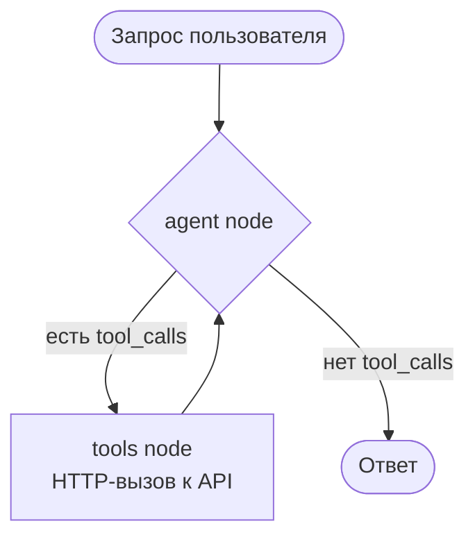

# Streak — трекер привычек на LangGraph

AI-агент на естественном языке для трекинга привычек. Принимает текстовые запросы, вызывает API через LangChain tools и возвращает ответ в фиксированном формате.

**Стек:** TypeScript · LangGraph · Ollama (локально) / OpenRouter (облако) · Hono

---

## Быстрый старт

### Вариант 1 — локально, с локальной моделью через Ollama (по умолчанию)

```bash
# 1. Зависимости
npm install

# 2. Переменные окружения
cp .env.example .env
# По умолчанию LLM_PROVIDER=ollama — нужен установленный и запущенный Ollama
# с моделью, поддерживающей tool calling (см. таблицу ниже). Если Ollama
# крутится не на этой машине — поменяйте OLLAMA_BASE_URL.

# 3. Запустить mock API (терминал 1)
npm run api

# 4. Запустить агента (терминал 2)
npm run agent "отметь медитацию выполненной"
```

### Вариант 1b — локально, с облачной моделью через OpenRouter

```bash
cp .env.example .env
# В .env поставить LLM_PROVIDER=openrouter и вставить OPENROUTER_API_KEY
# из openrouter.ai (бесплатно)

npm run api        # терминал 1
npm run agent "отметь медитацию выполненной"   # терминал 2
```

### Вариант 2 — Docker, с локальной моделью через Ollama

Если Ollama уже установлена и что-то в ней уже скачано (типичный случай, если вы проходите курс по AI) — контейнеру `agent` не нужна именно `qwen3.5:9b`, можно указать свою модель, лишь бы она поддерживала tool calling (`OLLAMA_MODEL`).

```bash
cp .env.example .env
# LLM_PROVIDER=ollama (по умолчанию), OLLAMA_MODEL=<ваша модель с поддержкой tools>
# OLLAMA_BASE_URL=http://host.docker.internal:11434/v1  ← Ollama на хосте, не в контейнере

docker compose up api -d

QUERY="создай привычку медитация" docker compose run --rm agent
QUERY="отметь медитацию выполненной" docker compose run --rm agent
QUERY="покажи все мои привычки" docker compose run --rm agent
```

Проверено вживую двумя способами:
- Ollama на этой же машине, что и Docker → `OLLAMA_BASE_URL=http://host.docker.internal:11434/v1` (Docker Desktop на macOS/Windows поддерживает из коробки).
- Ollama на другой машине в сети → обычный LAN-IP, например `http://192.168.1.10:11434/v1`, работает без доп. настройки (Docker bridge не изолирует от LAN).

> **`OLLAMA_BASE_URL=http://localhost:...` внутри контейнера работать не будет** — `localhost` там означает сам контейнер, а не хост.

**Про выбор модели:** чем меньше модель, тем менее строго она держит контракт ответа и порядок tool-вызовов — это подтверждено на практике (`docs/progress.md`). `qwen3.5:9b` — наша протестированная рекомендация, но не жёсткое требование; `llama3.1:8b` уже показала себя ненадёжно (см. таблицу ниже), совсем маленькие модели (2-4B) — тем более на свой риск.

### Вариант 2b — Docker, с облачной моделью через OpenRouter

```bash
cp .env.example .env
# LLM_PROVIDER=openrouter, вставить OPENROUTER_API_KEY из openrouter.ai

docker compose up api -d
QUERY="покажи все мои привычки" docker compose run --rm agent
```

---

## Примеры запросов

```bash
npm run agent "создай привычку читать книги"
npm run agent "отметь медитацию выполненной"
npm run agent "какой у меня стрик по медитации?"
npm run agent "покажи все мои привычки"
npm run agent "что такое streak?"
```

Ответ всегда в формате:
```
Status: success | error
Action: <что сделал агент>
Data: <результат>
Errors: <ошибка или ->
```

---

## API

Mock API поднимается локально на `http://localhost:3000`.

| Метод | Путь | Описание |
|---|---|---|
| `POST` | `/habits` | Создать привычку |
| `POST` | `/habits/:id/completions` | Отметить выполнение на сегодня |
| `GET` | `/habits/:id/streak` | Получить streak |
| `GET` | `/habits` | Список всех привычек со streak'ами |

---

## Архитектура агента



Реализован ручной `StateGraph` (`src/agent/graph.ts`) с явными узлами и рёбрами.

---

## Структура проекта

```
streak/
├── src/
│   ├── api/
│   │   ├── routes.ts       # In-memory хранилище + 4 эндпоинта
│   │   └── server.ts       # Запуск Hono-сервера
│   ├── agent/
│   │   ├── graph.ts        # StateGraph: agent ↔ tools
│   │   ├── tools.ts        # 4 LangChain tools (HTTP-обёртки)
│   │   └── prompt.ts       # Системный prompt
│   └── main.ts             # CLI точка входа
├── prompts/
│   └── system.md           # Системный prompt + описание tools
├── docs/
│   ├── DESIGN.md           # PRD + технический дизайн
│   └── report.md           # Отчёт по домашнему заданию
├── Dockerfile
├── docker-compose.yml
└── .env.example
```

---

## Переменные окружения

| Переменная | Описание |
|---|---|
| `API_BASE_URL` | URL mock API (по умолчанию `http://localhost:3000`) |
| `LLM_PROVIDER` | `ollama` (по умолчанию, локальная модель) или `openrouter` (облачная) |
| `OLLAMA_BASE_URL` | OpenAI-совместимый эндпоинт Ollama (по умолчанию `http://localhost:11434/v1`, можно указать другую машину в сети) |
| `OLLAMA_MODEL` | Модель в Ollama, обязательно с поддержкой tool calling (по умолчанию `qwen3.5:9b`, см. таблицу ниже) |
| `OPENROUTER_API_KEY` | API-ключ из [openrouter.ai](https://openrouter.ai) (бесплатно), нужен только при `LLM_PROVIDER=openrouter` |

Секреты хранятся в `.env` (в репозиторий не коммитится). Шаблон: `.env.example`.

### Локальные модели: что проверено

По результатам стресс-теста (`docs/progress.md`, раунд 2) на многошаговых цепочках tool-вызовов (list → create → mark):

| Модель | Итог |
|---|---|
| `qwen3.5:9b` | ✅ Рекомендуется. Стабильно соблюдает порядок вызовов, не дублирует привычки, не выдумывает id |
| `llama3.1:8b` | ⚠️ Не рекомендуется для этого проекта. Регулярно пропускает обязательный `list_habits`, дублирует привычки, в отдельных случаях подставляет в ответ несуществующие данные вместо реального результата tool-вызова |

Модель обязательно должна поддерживать tool calling — проверить можно через `curl http://<host>:11434/api/tags` и посмотреть на `capabilities` (`tools` должно быть в списке).

**Известное ограничение:** на однозначных запросах (создать/отметить/показать/стрик по названию) `qwen3.5:9b` держит формат ответа и порядок tool-вызовов стабильно. На неоднозначном или крайнем вводе (например, пустое название привычки) контракт `Status/Action/Data/Errors` иногда не соблюдается — see `docs/progress.md`, раунд 5. Это вероятностная особенность локальной 9B-модели, программно не валидируется.

---

## Документация

- [`docs/DESIGN.md`](docs/DESIGN.md) — PRD и технический дизайн
- [`docs/report.md`](docs/report.md) — отчёт по домашнему заданию
- [`prompts/system.md`](prompts/system.md) — системный prompt агента
