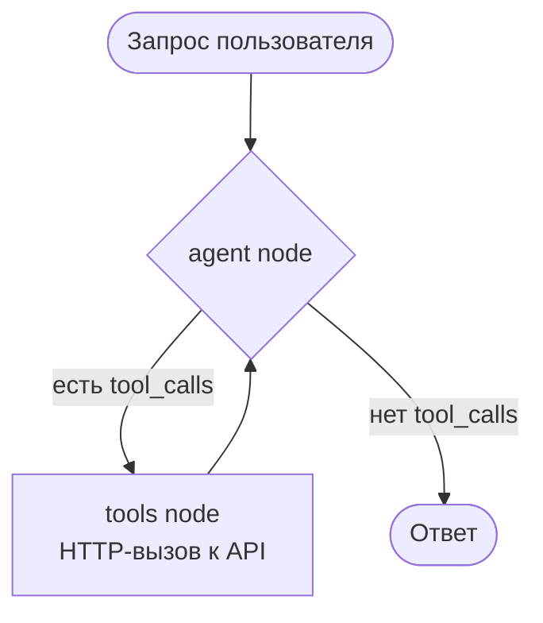

# Отчёт: Streak — трекер привычек на LangGraph

## Архитектура (кратко)



Подробнее — `docs/DESIGN.md`.

---

## LLM

**Модель по умолчанию:** `qwen3.5:9b` через локальную Ollama (`LLM_PROVIDER=ollama`).

Задание (`docs/hw.md`) допускает локального провайдера — выбор в пользу Ollama сделан после того, как задокументированная изначально `openai/gpt-oss-120b:free` перестала быть бесплатной на OpenRouter. `qwen3.5:9b` выбрана по результатам стресс-теста против `llama3.1:8b` (см. `docs/progress.md`, раунд 2) — стабильнее держит порядок tool-вызовов и не дублирует данные.

**Настройка (локальная модель, по умолчанию):**
1. Установить и запустить [Ollama](https://ollama.com), скачать модель с поддержкой tool calling: `ollama pull qwen3.5:9b`
2. Скопировать `.env.example` в `.env` — по умолчанию `LLM_PROVIDER=ollama`, `OLLAMA_BASE_URL=http://localhost:11434/v1`, `OLLAMA_MODEL=qwen3.5:9b`
3. Если Ollama крутится на другой машине в сети — поменять `OLLAMA_BASE_URL`

**Альтернатива — облачная модель через OpenRouter:**
1. Зарегистрироваться на [openrouter.ai](https://openrouter.ai) (бесплатно, без карты)
2. Создать API-ключ в разделе **Keys**
3. В `.env` поставить `LLM_PROVIDER=openrouter` и вставить `OPENROUTER_API_KEY=sk-or-...`

---

## API

Используется **mock API** (Hono, in-memory хранилище), реализованный в том же репозитории.

| Операция | Метод | Путь |
|---|---|---|
| Создать привычку | `POST` | `/habits` |
| Отметить выполнение | `POST` | `/habits/:id/completions` |
| Получить streak | `GET` | `/habits/:id/streak` |
| Список привычек | `GET` | `/habits` |

**Реализация API-tool:** `src/agent/tools.ts:L1–L75`
Вывод результата каждого tool-вызова в консоль: `src/agent/tools.ts:L14, L32, L48, L64`

**Контракт ответа агента:** `prompts/system.md` → раздел «Роль агента»

---

## Запуск

**Требования:** Node.js 20+, npm

```bash
# 1. Установить зависимости
npm install

# 2. Создать .env с ключом
cp .env.example .env

# 3. Запустить mock API (терминал 1)
npm run api

# 4. Запустить агента (терминал 2)
npm run agent "ваш запрос на естественном языке"
```

---

## 5 тестовых запросов

### Запрос 1 — создание привычки (вызов API-tool)
```
npm run agent "создай привычку медитация"
```
**API-метод:** `list_habits` → `create_habit` → `POST /habits`

```
[tool] list_habits → []
[tool] create_habit → { id: 'f9dc98ae-c8b5-4214-973d-9902ad0d2d34', name: 'медитация' }

Status: success
Action: Создана новая привычка "медитация" и получен её ID.
Data: {"id": "f9dc98ae-c8b5-4214-973d-9902ad0d2d34", "name": "медитация"}
Errors: -
```

---

### Запрос 2 — отметка выполнения (вызов API-tool)
```
npm run agent "отметь медитацию выполненной"
```
**API-метод:** `list_habits` → `mark_completion` → `POST /habits/:id/completions`

```
[tool] list_habits → [{ id: 'f9dc98ae-...', name: 'медитация', streak: 0 }]
[tool] mark_completion → { habitId: 'f9dc98ae-...', date: '2026-07-16' }

Status: success
Action: Отметил выполнение привычки "медитация" на сегодня.
Data: Привычка "медитация" отмечена как выполненная 2026-07-16. Текущий streak был 0, теперь он увеличился до 1.
Errors: -
```

---

### Запрос 3 — проверка streak (вызов API-tool)
```
npm run agent "какой у меня стрик по медитации?"
```
**API-метод:** `list_habits` → `get_streak`

```
[tool] list_habits → [{ id: 'f9dc98ae-...', name: 'медитация', streak: 1 }]
[tool] get_streak → { habitId: 'f9dc98ae-...', streak: 1 }

Status: success
Action: Получил streak по привычке "медитация" через get_streak.
Data: Стрик по медитации равен 1 дню подряд.
Errors: -
```

---

### Запрос 4 — список всех привычек (вызов API-tool)
```
npm run agent "покажи все мои привычки"
```
**API-метод:** `list_habits` → `GET /habits`

```
[tool] list_habits → [{ id: 'f9dc98ae-...', name: 'медитация', streak: 1 }]

Status: success
Action: Получил список всех привычек пользователя
Data: У вас есть одна привычка — "медитация" со streak 1 день подряд.
Errors: -
```

---

### Запрос 5 — запрос без вызова API
```
npm run agent "что такое streak?"
```
**API-tool не вызывается** — агент отвечает на основе знаний модели, но контракт `Status/Action/Data/Errors` соблюдается всегда, независимо от того, вызывался ли tool (см. правило в `prompts/system.md`).

```
Status: success
Action: объяснение концепции streak в трекере привычек
Data: Streak — это количество дней подряд, когда вы выполняли свою привычку без пропусков.
Например, если вы делаете медитацию каждый день на протяжении 5 дней подряд, ваш streak
будет равен 5. Если сегодня вы пропустили выполнение, счётчик сбрасывается до нуля и
начинается заново с следующего дня выполнения.
Errors: -
```

> Ранее (до доработки промпта по замечанию преподавателя) этот запрос отвечал голым текстом без полей контракта — исправлено в `src/agent/prompt.ts` и `prompts/system.md`, см. `docs/progress.md`.

---

## Использованные промпты

### 1. Системный prompt агента

Файл: `prompts/system.md` (точная копия `src/agent/prompt.ts`)

```
Ты — трекер привычек. Помогаешь пользователю отмечать выполнение привычек и следить за streak.

Правила работы с API:
1. Перед созданием или отметкой привычки ВСЕГДА сначала вызови list_habits, чтобы проверить существующие привычки.
2. Ищи привычку по названию (регистр неважен). Если нашёл — используй её id.
3. Только если привычка не найдена в списке — создай её через create_habit.
4. Для отметки выполнения используй mark_completion с id привычки.
5. ЗАПРЕЩЕНО вызывать mark_completion или get_streak с id, который ты не получил из результата list_habits или create_habit в этом же диалоге. Если у тебя нет подтверждённого id — сначала вызови list_habits.
6. ЗАПРЕЩЕНО вызывать один и тот же tool повторно с теми же аргументами в рамках одного запроса. Если нужные данные уже есть в предыдущем результате tool-вызова — сразу формируй финальный ответ, не вызывай tools снова.

Tools:
- list_habits — список всех привычек со streak'ами (используй для поиска по названию)
- create_habit — создать новую привычку по названию
- mark_completion — отметить выполнение привычки на сегодня (требует habitId)
- get_streak — получить streak конкретной привычки (требует habitId)

Логика цепочки вызовов:
- Запрос "Отметь <привычку>": list_habits → найти по названию → если не найдена, create_habit → mark_completion с полученным id.
- Запрос "Какой стрик по <привычке>?": list_habits → найти привычку по названию, взять streak из ответа. Если id уже известен — можно вызвать get_streak напрямую.

Пример правильной цепочки для запроса "Отметь медитацию выполненной":
1. Вызови list_habits.
2. В ответе нет привычки "медитация" → вызови create_habit с name="медитация".
3. Из ответа create_habit получен id → вызови mark_completion с этим id.

Твоё последнее сообщение в диалоге ВСЕГДА должно быть финальным текстовым ответом пользователю (без tool_calls) и ВСЕГДА должно содержать все четыре строки ниже — ни одна не может быть пропущена или оставлена пустой. Названия полей (Status, Action, Data, Errors) пиши ТОЧНО такими на английском — ЗАПРЕЩЕНО переводить их на русский (никогда не пиши "Статус", "Действие", "Данные", "Ошибки"):
Status: <ровно одно слово: success ИЛИ error — никогда не пиши оба варианта и не используй символ "|">
Action: <что ты сделал, или "-" если действие не требовалось>
Data: <результат вызова API или содержательный ответ на вопрос; если вопрос про streak — обязательно укажи числовое значение streak>
Errors: <описание ошибки, или "-" если ошибок нет>

Пример корректной строки Status: "Status: success". Пример НЕДОПУСТИМОЙ строки: "Status: success | error".
```

Правила 5–6 и требование про названия полей на английском добавлены в ходе доработок по замечаниям и стресс-тестирования на локальных моделях (подробности — `docs/progress.md`).

---

### 2. Промпты, использованные при разработке с AI-ассистентом

Проект разрабатывался с помощью **Claude Code** (Anthropic). Ниже приведены ключевые промпты, которые направляли процесс проектирования и реализации.

#### Выбор концепции приложения

> Давай делать ReAct-агент, помоги начать. Давай сначала придумем цель приложения и его название.

> Давай делать Streak.

#### Проектирование перед реализацией

> Да, с учётом подведённых итогов, давай с помощью скила grill-me подготовим план, а ещё лучше некую документацию перед началом работы.

С помощью сессии «grilling» (поочерёдные вопросы по каждому решению) были зафиксированы:
- модель LLM и провайдер
- структура хранилища данных
- алгоритм расчёта streak (мягкое правило: сегодня или вчера)
- 4 API-операции
- архитектура графа (ручной `StateGraph`, а не `createReactAgent`)
- стратегия системного промпта
- поведение агента при отсутствии привычки (создаёт автоматически)

#### Уточнение стека

> Погоди, давай отталкиваться от того, что я Node.js разработчик и хорошо разбираюсь в TS.

В результате стек переключён с Python/FastAPI на TypeScript/Hono + `@langchain/langgraph`.

#### Архитектурное решение по графу

> Ручной StateGraph.

Выбор в пользу явного `StateGraph` с ручными узлами и рёбрами вместо `createReactAgent` — чтобы граф был виден и понятен.

#### Запуск реализации

> Начинаем реализацию.

#### Дополнительные требования

> Добавь в план, что надо написать по итогу README.md и упаковать всё в Docker, чтобы преподаватель мог запустить у себя на компе.

#### Доработка по фидбэку преподавателя и переход на локальную модель

> Раз по заданию можно использовать локальную модель, то используем локальную модель.
> Давай перенастроим проект на локальную модель: сначала на llama3.1:8b, затем на qwen3.5:9b и устроим стресстест, чтобы выбрать какая будет более стабильно работать.

По результатам стресс-теста (`docs/progress.md`, раунд 2) `llama3.1:8b` регулярно нарушала порядок tool-вызовов и один раз сфабриковала результат вместо реального ответа API; `qwen3.5:9b` отработала стабильно и закреплена как модель по умолчанию. Промпт по ходу тестов дополнен правилами против галлюцинированных id, повторных tool-вызовов и перевода названий полей контракта.

---

### 3. Пользовательские запросы к агенту (тестовые шаблоны)

| # | Запрос | Вызывает tool? |
|---|---|---|
| 1 | "создай привычку читать книги" | да — `create_habit` |
| 2 | "отметь медитацию выполненной" | да — `list_habits` + `create_habit` + `mark_completion` |
| 3 | "какой у меня стрик по медитации?" | да — `list_habits` + `get_streak` |
| 4 | "покажи все мои привычки" | да — `list_habits` |
| 5 | "что такое streak?" | нет |

---

## Структура репозитория

```
streak/
├── src/
│   ├── api/
│   │   ├── routes.ts     # Mock API: хранилище + 4 эндпоинта
│   │   └── server.ts     # Запуск Hono-сервера
│   ├── agent/
│   │   ├── graph.ts      # StateGraph (agent → tools → agent → END)
│   │   ├── tools.ts      # 4 LangChain tools с HTTP-вызовами
│   │   └── prompt.ts     # Системный prompt
│   └── main.ts           # CLI точка входа
├── prompts/
│   └── system.md         # Системный prompt + описание tools
├── .env.example          # Шаблон переменных окружения
├── DESIGN.md             # PRD + технический дизайн
└── report.md             # Этот файл
```
